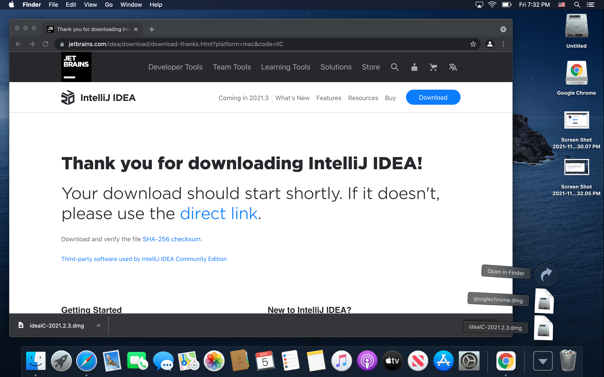
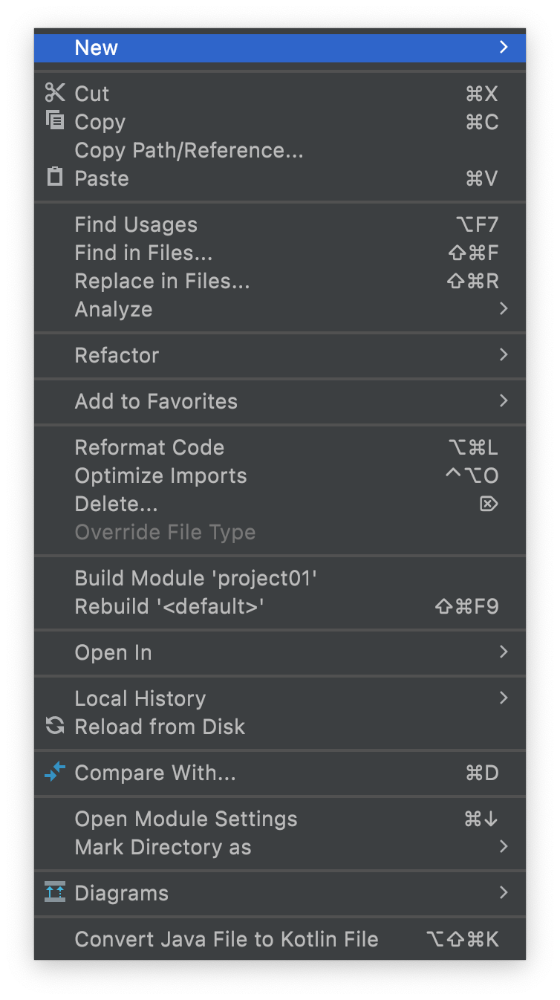

# My First Program

Welcome to your first lab as a code differently student!


The first step into mastering these is selecting the proper tools!!

As every carpenter need's their hammer, every developer need's their IDE!! (Integrated Development Environment). 

## What is an IDE?

An IDE, or Integrated Development Environment, enables programmers to consolidate the different aspects of writing a computer program.

IDEs increase programmer productivity by combining common activities of writing software into a single application: editing source code, building executables, and debugging.

## Time to configure your machine


### The Coder's Creed

> This is my laptop. There are many like it, but this one is mine.

>My laptop is my best friend. It is my profession. I must master it as I must master my profession.

>Without me, my laptop is useless. Without my laptop, my code is useless. I must code on my laptop true. I must write code well, so that I can secure the bag!


Understanding what is installed on your machine, is paramount! You are no longer waiting for IT to install things, you are NOW IT!.


### Step 01 Download IntelliJ

In a web browser go to the following url [IntelliJ](https://www.jetbrains.com/idea/download/#section=mac)

What is Intellij? IntelliJ IDEA is an Integrated Development Environment (IDE) for JVM languages designed to maximize developer productivity. 

It's also the prefered IDE of the Sophisticated Developer.


The Web Page should look like this :


You want to select blue button the COMMUNITY EDITION for the APPLE M1. Once you do that the download will begin.


Once the download is complete, you can find the installer in the DOWNLOADs folder like below.



Once you open the DMG installer you should see the following screen. 


Follow the instructions , and drag the file to the folder.

## Step 02 Open Intellij and Install Java

Click your mouse on your desktop to make sure you have the finder menu visible, and select the GO option like below:


On the GO menu select the Applications folder:


In the Applications folder select Intellij:


Follow all of the default first time instructions:


You have successfully opened the application when you see the below screen, select NEW PROJECT:


When ever you are creating a NEW PROJECT, for now your selection will be MAVEN:


Its now time to select an SDK, the issue is that there is no SDK on your system, Select the dropdown for SDK, and click DOWNLOAD SDK


Select version 17 or higher and click download:


Everything went according to plan if you see the screen Below:


## Step 03 Setup your dev folder

Where you place your code is just as important as how well you Write your code, so let's start off on the RIGHT FOOT!

Select the NEXT button and you will see the following screen, select the folder icon to the right of LOCATION:


Next you what to Select your HOME directory, the name of your directory won't match thook, but you should see something similar to below with eth House ICON next to it:


Create A New Folder in your home directory called dev: 


Your Screen should look like this, select NEW FOLDER again:


Give this folder the name of project01:


Your window should look like this now, select finish:


If everything when according to plan, your screen should look like the following:


Right mouse click or hold down "Control" and left mouse click on the Java folder:


You will see the following menu below, select new:



Next select JAVA , and name the File `Main`

Replace the code inside the file with the following:

```java

public class Main {

    public static void main(String[] args) {
        System.out.println("Hello world, Wutang Clan is for the kids!!!!");
    }
}
```

To run your very first program select the GREEN arrow : and watch the magic happen!!!


## Finished


